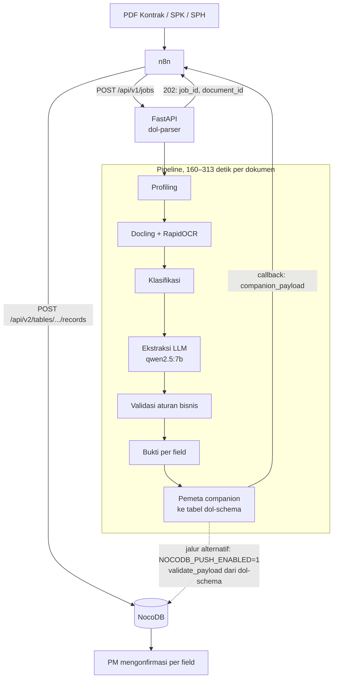

# dol-parser — Parser & Ekstraktor Dokumen Pengadaan (Open ADE)

Membaca PDF **Kontrak/SPK dan SPH vendor** lalu mengeluarkan data terstruktur yang tertaut
ke kutipan sumbernya, siap masuk NocoDB untuk dikonfirmasi PM. BAST juga bisa diekstrak,
tetapi belum dikirim ke NocoDB: tabelnya masih usulan (lihat repo `dol-schema`).

Ini bagian **AI Engineer** dari Delivery Ops Layer — lapisan otomasi yang berdiri di
sebelah MyBhakti, bukan di dalamnya. Dua komponen lain dipegang rekan setim:
n8n/numbering (RPA Engineer) dan evidence/ODK (Network Engineer).

## Kenapa sistem ini ada

Invoice ke pelanggan baru bisa terbit setelah **BAST Pelanggan** diteken. Hari ini BAST sering
terlambat, walaupun barang sudah terpasang dan berfungsi. Sebabnya: data kontrak diketik ulang
di beberapa dokumen, SPH vendor yang formatnya berbeda-beda diketik ulang jadi tabel banding,
dan syarat lampiran dari kontrak baru ketahuan kurang saat BAST mau ditandatangani. Selama
BAST tertahan, uang perusahaan ikut tertahan.

```
Barang terpasang → Evidence & lampiran kontrak → BAST diteken → Invoice → Uang masuk
                    ↑ macet di sini
```

Repo ini menangani bagian hulunya: kontrak dibaca **sekali** di awal proyek, SPH dibaca setiap
penawaran masuk, dan hasilnya disimpan di satu tempat yang bisa dipakai tiga tim. PM tetap
memeriksa setiap field sebelum nilainya dipakai dokumen lain. Dampaknya belum diukur: angka
awal (menit mengetik ulang per SPH, jumlah BAST yang dikembalikan) belum dikumpulkan.

## Teknologi

| Lapisan | Dipakai | Catatan |
|---|---|---|
| Bahasa | Python 3.11 | |
| API | FastAPI + uvicorn | antrian job asinkron, satu dokumen pada satu waktu |
| Parsing PDF | Docling, PyMuPDF | PyMuPDF untuk teks native & profiling |
| OCR | RapidOCR (default) | alternatif: Apple Vision (`mac`), Tesseract, PaddleOCR |
| LLM | Qwen 2.5 7B (`qwen2.5:7b`) lewat Ollama | jalan lokal, dokumen tidak keluar dari mesin |
| Skema ekstraksi | Pydantic v2 | per jenis dokumen, di `app/schemas/` |
| Skema database | repo `dol-schema`, versi `companion-2026.10.4` | dipasang editable dari folder sebelah |
| Penyimpanan | NocoDB (API v2) | tempat PM mengonfirmasi per field |
| Orkestrasi | n8n | dipegang RPA Engineer, di luar repo ini |

Alur di dalam pipeline:

```
PDF ──> profiling ──> parsing+OCR ──> klasifikasi ──> ekstraksi LLM ──> validasi ──> bukti
                                                                                       │
                   companion_payload (tabel dol-schema) ──> n8n / pusher ──> NocoDB ──┘
                                                                              │
                                                     PM mengonfirmasi per field (Keputusan PM)
```

Bentuk datanya **tidak** didefinisikan di repo ini, melainkan di repo **`dol-schema`**
(folder sejajar). Kamus data berbahasa Indonesia: `../dol-schema/generated/KAMUS_DATA.md`.

---

## Mulai dari sini

**Prasyarat:** Python 3.11, [Ollama](https://ollama.com/download), ±6 GB ruang disk, dan
repo `dol-schema` di folder sejajar (`../dol-schema`).

```bash
python3.11 -m venv .venv311
make pasang                   # requirements.txt + pip install -e ../dol-schema

ollama pull qwen2.5:7b        # ~4.7 GB
ollama serve                  # biarkan jalan di terminal terpisah

cp .env.example .env          # lalu isi OPENADE_API_KEY dan kredensial NocoDB
```

### Proses satu dokumen

```bash
.venv311/bin/python run.py "dokumen.pdf"
```

Menghasilkan tiga berkas di `storage/outputs/`:

| Berkas | Isi | Dibaca oleh |
|---|---|---|
| `parsing/*.parse.md` | markdown hasil parsing | manusia |
| `parsing/*.parse.json` | blok + bounding box per halaman | debugging |
| `extraction/*.extract.json` | nilai field + bukti + skor | manusia, eval, `scripts/companion.py` |

Lalu ke NocoDB (setelah base dibuat, lihat [docs/SETUP_NOCODB.md](docs/SETUP_NOCODB.md)):

```bash
.venv311/bin/python scripts/companion.py --map storage/outputs/extraction/dokumen.extract.json
.venv311/bin/python scripts/companion.py --push storage/outputs/companion/dokumen.companion.json --dry-run
```

### Jalankan sebagai service

```bash
make serve            # http://localhost:8000/docs
curl -s localhost:8000/health | python -m json.tool
```

`status: "degraded"` = storage siap tapi Ollama mati.

---

## Dipanggil dari n8n

**Pakai `POST /api/v1/jobs`, bukan `/api/v1/process-all`.** Satu dokumen butuh 160–313
detik; endpoint sinkron akan timeout di n8n.

```bash
curl -X POST localhost:8000/api/v1/jobs \
  -H "X-API-Key: $OPENADE_API_KEY" \
  -F "file=@dokumen.pdf" \
  -F "callback_url=https://n8n.internal/webhook/abc"
# -> 202 {"job_id":"job-xxx","document_id":"doc-xxx","status":"queued"}
```

`document_id` adalah sidik isi berkas (sha256), dikembalikan **sebelum** dokumen diproses,
dan **sama dengan kunci baris Dokumen di NocoDB** (`content_hash`). Kirim PDF yang sama dua
kali → baris yang sama diperbarui, bukan baris kembar. Rangkaian node lengkapnya:
**[docs/INTEGRASI_N8N.md](docs/INTEGRASI_N8N.md)**.

### Alur ujung ke ujung



dol-schema ikut di dua titik. Pemeta companion memakai nama tabel & kolomnya untuk menyusun
`companion_payload`, dan pusher bawaan (`NOCODB_PUSH_ENABLED=1` atau `scripts/companion.py
--push`) menjalankan `validate_payload` sebelum mengirim. **Di jalur n8n, payload tidak
divalidasi dol-schema sebelum masuk NocoDB**: n8n meneruskannya apa adanya. Siapa yang
seharusnya memvalidasi di jalur itu (FastAPI sebelum callback, atau n8n membaca
`generated/schema.json`) belum diputuskan bersama RPA Engineer.

---

## Aturan yang ditegakkan kode ini

1. **Hasil ekstraksi tidak pernah otomatis dipakai.** Nilai sistem (Hasil Ekstraksi) dan
   keputusan PM (Keputusan PM) adalah tabel terpisah; pipeline ditolak bila mencoba menulis
   ke tabel PM. Dokumen hilir hanya memakai nilai yang dikonfirmasi PM
   (`app/companion/generator.py`, view `nilai_terverifikasi`).
2. **Dokumen yang sudah mulai diperiksa PM tidak ditimpa.** Pusher menolak mengirim ulang
   dokumen yang sudah punya Keputusan PM, kecuali diminta (`--timpa-yang-direview`).
3. **Tidak ada nilai karangan.** Nilai yang tidak terbaca dikirim kosong; tidak ada kota,
   penandatangan, atau hasil uji bawaan. Sistem juga tidak menghitung nilai yang tidak
   tertulis di dokumen (mis. PPN dari total − subtotal).
4. **MyBhakti tidak pernah disentuh.** Klien/Vendor/Proyek/PO hanya kolom rujukan
   `mybhakti_*_ref` yang diisi n8n — pipeline tidak pernah mengirimnya, supaya isian n8n
   tidak terhapus saat proses ulang.
5. **Baseline diukur sebelum apa pun diubah.** `eval/` membandingkan hasil terhadap golden
   set; golden yang belum dikoreksi manusia tidak ikut dihitung.

### Status bukti per field

Setiap field keluar dengan status yang menyatakan **seberapa kuat buktinya di dokumen** —
bukan apakah nilainya benar. Persetujuan tetap milik PM.

| Di pipeline | Tampil di NocoDB | Artinya | Prioritas review |
|---|---|---|---|
| `AUTO_VERIFIED` | `bukti_kuat` | ditemukan persis di dokumen, lolos semua aturan | rendah — **harga tetap wajib dicek** |
| `AUTO_ACCEPTED` | `bukti_cukup` | bukti kuat tapi tidak persis | rendah |
| `REVIEW_REQUIRED` | `perlu_dicek` | bukti lemah, atau ada aturan yang memberi peringatan | sedang |
| `UNSUPPORTED` | `tidak_ada_di_dokumen` | **nilai tidak ditemukan di satu blok pun** | **tertinggi** |
| `CONFLICT` | `bertentangan` | melanggar aturan konsistensi | tinggi |
| `MISSING` | `kosong` | tidak terisi | — |

`bukti_kuat` memeriksa **keberadaan**, bukan **peran**: nomor kontrak yang salah tetap
`bukti_kuat` bila nomor lain di dokumen kebetulan sama. Karena itu namanya tidak memakai
kata "terverifikasi".

---

## Peta kode

| Folder | Isi |
|---|---|
| `app/ingestion/` | profiling PDF: scan atau teks native, perlu OCR atau tidak |
| `app/parsers/` | Docling & PaddleOCR, tabel, pembersih teks, render markdown |
| `app/document_ir/` | representasi antara yang seragam untuk semua parser |
| `app/services/` | klasifikasi dokumen, orkestrasi pipeline, antrian job |
| `app/extractors/` | prompt & klien Ollama, ekstraktor deterministik (tanggal, angka) |
| `app/schemas/` | skema Pydantic **ekstraksi** per jenis dokumen (bukan skema database) |
| `app/validation/` | aturan bisnis (mis. subtotal + PPN = grand total) |
| `app/evidence/` | menautkan tiap field ke kutipan & bounding box asalnya |
| `app/companion/` | pemeta hasil ekstraksi → tabel dol-schema, pusher NocoDB, penyusun draf BAST |
| `eval/` | harness akurasi terhadap `eval/golden/` |
| `scripts/` | `companion.py` (payload & push), `nocodb_setup.py` (base & cek), `cek_ocr.py` (mesin OCR yang hidup), `buat_golden.py` (rangka golden) |

---

## Pengembangan

```bash
.venv311/bin/pip install -r requirements-dev.txt
make test                     # seluruh tes
make eval                     # akurasi vs golden set
make cek-nocodb               # sambungan & tableId NocoDB
make cek-skema                # tabel NocoDB vs dol-schema, kolom per kolom
make cek-rahasia              # pindai kredensial sebelum push
```

### Memilih mesin OCR

```bash
OCR_ENGINE=tesseract .venv311/bin/python run.py "dokumen.pdf"
```

Pilihan: `rapidocr` (default), `mac`, `tesseract`, `paddle`, `auto`.
Default sengaja `rapidocr`, bukan `mac`: Apple Vision hanya ada di macOS, jadi akurasi
yang diukur dengannya tidak bisa ditepati server Linux.

### Menambah golden document

```bash
.venv311/bin/python run.py "dokumen_baru.pdf"
.venv311/bin/python scripts/buat_golden.py "dokumen_baru.pdf"   # rangka untuk dikoreksi
# koreksi nilainya dengan tangan terhadap PDF asli, hapus "belum_dikoreksi", lalu:
make eval
```

---

## Keamanan

- **`.env` tidak pernah di-commit.** Repo ini publik. Rujukannya `.env.example`.
- **Data klien tidak pernah masuk git** — `sample_pdfs/`, `storage/outputs/`,
  `eval/golden/`, `storage/data_project_*.json` semuanya di-ignore.
- **Isi `OPENADE_API_KEY`** sebelum service dijangkau dari luar localhost. Di server, pakai
  `OPENADE_ENV=production`: tanpa API key server menolak naik, `callback_url` dibatasi ke
  `CALLBACK_ALLOWED_HOSTS`, dan galat 500 tidak membocorkan isi exception.

---

## Dokumentasi lain

| Dokumen | Isi |
|---|---|
| [docs/TROUBLESHOOTING.md](docs/TROUBLESHOOTING.md) | **ada yang error?** mulai dari sini |
| [docs/SETUP_NOCODB.md](docs/SETUP_NOCODB.md) | membuat base NocoDB dari dol-schema & mengirim data |
| [docs/INTEGRASI_N8N.md](docs/INTEGRASI_N8N.md) | rangkaian node n8n → FastAPI → NocoDB |
| `../dol-schema/docs/WORKSHOP_SKEMA.md` | keputusan skema yang masih terbuka (bertiga) |

---

## Batas yang disengaja

- **Satu dokumen pada satu waktu.** Docling/PaddleOCR/Ollama berebut CPU yang sama.
- **Status job di memori.** Restart uvicorn menghilangkan job berjalan.
- **Integritas NocoDB dijaga pengirim.** Tabel yang dibuat lewat API NocoDB tidak punya
  UNIQUE/FK/CHECK; validator dol-schema dan pusher yang menjaganya. Constraint sungguhan
  hanya ada bila memakai `schema.sql` di PostgreSQL.
- **Ini pengisian formulir dengan bantuan AI, bukan review kontrak.**
